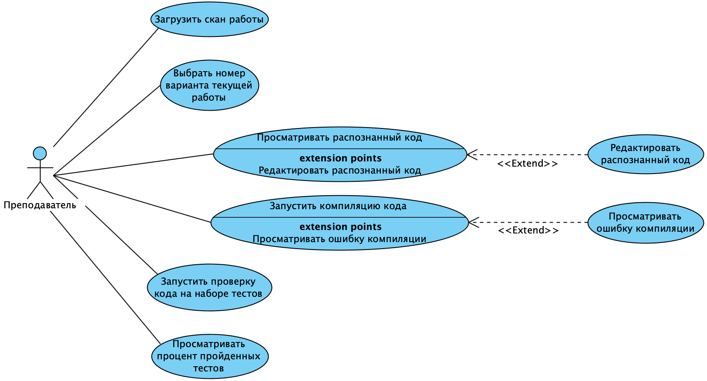

Лабораторная работа №1
------
***Тема:*** Разработка приложения для автоматизации проверки письменных экзаменационных работ по программированию на C#

***Цель работы:*** Разработать программное приложение для проверки письменных экзаменационных работ по программированию на C#, включающее обработку рукописного текста, перевод кода в цифровой формат, анализ кода, компиляцию и тестирование кода на готовых тестах с последующим выставлением оценки.

***Ожидаемые результаты:***
1. Перечень заинтересованных лиц (стейкхолдеров):
    - преподаватели дисциплины "Программирование" в НИУ ВШЭ Пермь - преподаватели, проверяющие экзамен по программированию на C#.
2. Перечень функциональных требований:
    - преподаватель загружает скан письменной работы студента в систему;
    - преподаватель выбирает номер варианта текущей работы;
    - письменный код, предоставленный студентом в качестве ответа на задание, переводится в цифровой формат;
    - преподаватель может просматривать и редактировать цифровой код, выданный системой в результате распознавания письменного кода;
    - преподаватель запускает компиляцию цифрового кода;
    - если код не компилируется, выводится ошибка;
    - преподаватель запускает проверку цифрового кода на наборе автоматических тестов;
    - после прохождения автоматического тестирования выводится процент пройденных тестов;
    - преподаватель может посмотреть процент пройденных тестов для всех заданий в одном окне.
3. Диаграмма вариантов использования для функциональных требований:
    
4. Перечень сделанных предположений:
    - количество вариантов и заданий ограничено;
    - точность распознавания кода должна стремиться к 100%, но может быть и ниже;
    - возможно автоматическое выставление итоговой оценки системой, требуется дальнейшее обсуждение:
        - необходимо проработать критерии оценивания;
        - если итоговая оценка ниже 4 - преподаватель проверяет еще раз самостоятельно.
        
***Перечень нефункциональных требований***
- производительность - время распознавания письменного кода не должно превышать 30(?) секунд;
- доступность - система должна быть доступна 24 часа в сутки, за исключением программных сбоев;
- масштабируемость - с ростом объема письменных работ или объема письменного кода система должна вовремя распознавать письменный код;
- надежность - в процессе взаимодействия пользователя с системой не должен случиться сбой;
- проверяемость - должна быть возможность просмотреть распознанный код и отредактировать его.
